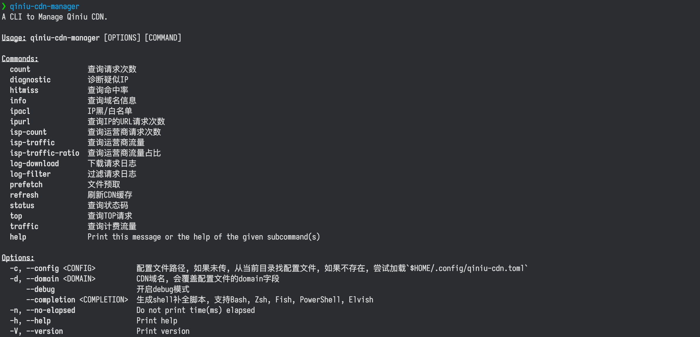
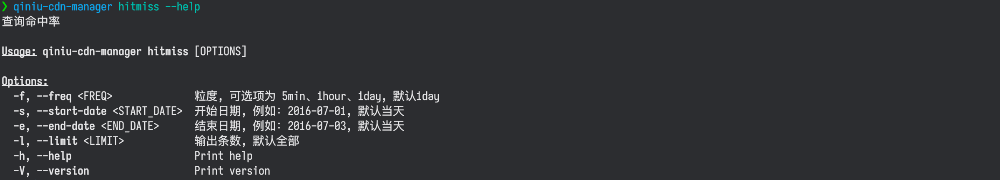

# 七牛 CDN 管理工具

提供七牛 CDN 数据查询、流量告警、修改 IP 黑/白名单、诊断疑似 IP、日志过滤等功能

结合`Linux Crontab`可以实现流量告警及添加 IP 黑名单等功能的自动化

更完整的功能，请移步[七牛 CDN 后台](https://portal.qiniu.com/cdn/overview)

## 用法





1. 修改配置文件的[模板](./qiniu-cdn.toml.example)，重命名为`qiniu-cdn.toml`，可以通过`--config`参数指定配置文件的路径，如果未指定，会从当前目录查找，如果还是未找到，从`$HOME/.config`目录查找

1. 通过`qiniu-cdn-manager --help` 查看支持的命令，用法为: `qiniu-cdn-manager [OPTIONS] [COMMAND]`

> - 采用配置文件 ➕ 命令行参数的方式来确定参数，命令行参数输入的参数优先级高于配置文件

> - 功能主要由各个子命令来完成，如`info`、`ipacl`等，通过`qiniu-cdn-manager subcommand --help`可查看子命令的参数

> - 支持 shell 命令补全，目前支持`fish`、`bash`及`zsh`。也可以通过`qiniu-cdn-manager --completion fish|zsh|bash`来生成

## 下载

- [⬇️ 点击下载 x86_64-apple-darwin](https://github.com/bujnlc8/qiniu-cdn-manager/releases/download/0.1.1/qiniu-cdn-manager_x86_64-apple-darwin.tar.gz)

  > [qiniu-cdn-manager_x86_64-apple-darwin.tar.gz.md5](https://github.com/bujnlc8/qiniu-cdn-manager/releasess/download/0.1.1/qiniu-cdn-manager_x86_64-apple-darwin.tar.gz.md5)

- [⬇️ 点击下载 aarch64-apple-darwin](https://github.com/bujnlc8/qiniu-cdn-manager/releases/download/0.1.1/qiniu-cdn-manager_aarch64-apple-darwin.tar.gz)

  > [qiniu-cdn-manager_aarch64-apple-darwin.tar.gz.md5](https://github.com/bujnlc8/qiniu-cdn-manager/releasess/download/0.1.1/qiniu-cdn-manager_aarch64-apple-darwin.tar.gz.md5)

- [⬇️ 点击下载 x86_64-unknown-linux-musl](https://github.com/bujnlc8/qiniu-cdn-manager/releases/download/0.1.1/qiniu-cdn-manager_x86_64-unknown-linux-musl.tar.gz)

  > [qiniu-cdn-manager_x86_64-unknown-linux-musl.tar.gz.md5](https://github.com/bujnlc8/qiniu-cdn-manager/releasess/download/0.1.1/qiniu-cdn-manager_x86_64-unknown-linux-musl.tar.gz.md5)

请根据你的操作系统下载相应的版本，可对比 md5 hash 值确定是否下载了最新的版本

解压后运行，在 Macos 中如果出现`"qiniu-cdn-manager" is damaged and can't beopened.`的提示，请尝试执行以下命令:

```
sudo spctl --master-disable
```

**在 Arm 版的 Mac 上如果仍然打不开，可以尝试 x86 的版本**

## 编译

```
cargo build --release --locked
```

**如果在使用过程中发现 bug，欢迎反馈 👏**
